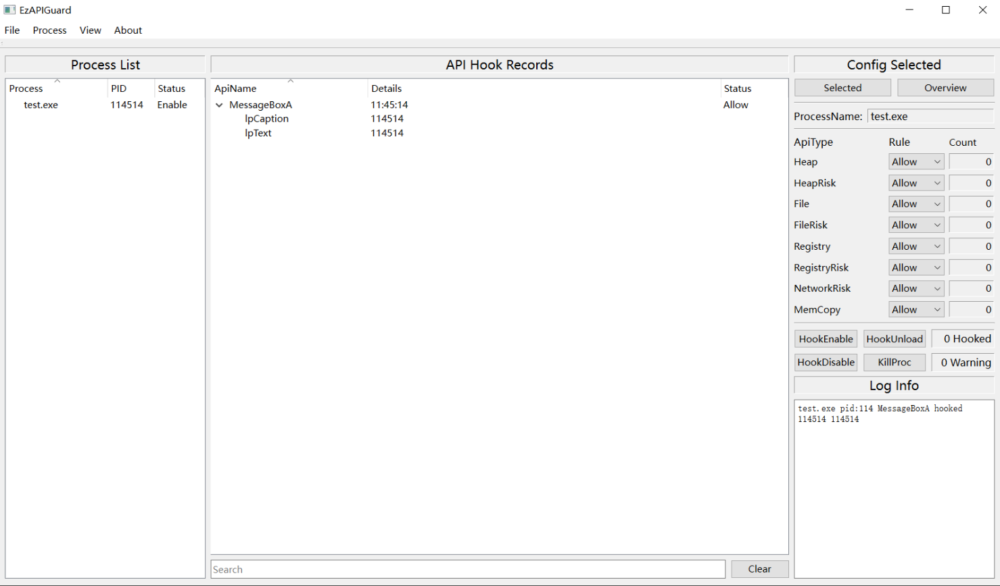

## EzAPIGuard | 基于API HOOK的程序行为分析工具

### Ⅰ Overview

### Ⅱ Framework

~~过于乐色不便展示~~

#! TODO @xiaoketx

### Ⅲ Features

- 进程动态附加

- exe启动附加

- 多进程监控

- hook动态配置

- 记录保存与加载

- ...

### Ⅳ Build

#### 1.编译环境

Visual Studio 2022（with C++的桌面开发MSVC and .NET桌面开发）

Python >= 3.10 (with pip and venv)

#### 2.编译构建

项目基于MSBuild环境配置，使用Visual Studio加载EzAPIGuard.sln，右键EzAPIGuardGUI项目选择生成即可自动构建，项目输出在out目录下
