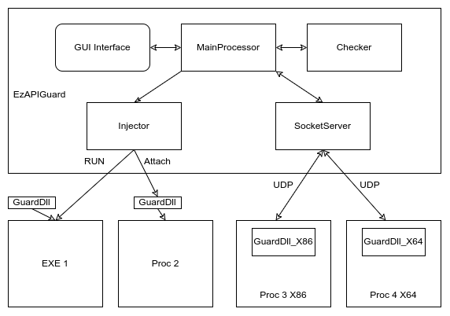

## EzAPIGuard | 基于API HOOK的程序行为分析工具

### Ⅰ Overview

> EzAPIGuard是基于API HOOK实现的程序行为分析监控工具，包含对常用文件操作、堆操作、注册表操作以及网络操作的API调用分析，提取程序的危险操作，对程序的API调用进行拦截。

- 多进程监控

- 权限控制

- 记录保存与导入

### Ⅱ Framework

项目由EzAPIGuard及GuardDll两部分构成。

EzAPIGuard包含dll注入器、socket服务器、API分析器以及GUI界面，负责将GuardDll注入目标进程、接收目标进程API调用信息，分析API行为及界面显示。

GuardDll基于Detours实现，注入目标进程后hook程序API,拦截API调用及参数信息，与主程序通信并实现API放行、拦截等操作。

### Ⅲ Features

- 进程动态附加

- exe启动附加

- x86 x64双架构支持

- 多进程监控

- hook动态配置

- 权限控制

- 记录保存与加载

- ...

### Ⅳ Build

#### 1.编译环境

Visual Studio 2022（with C++的桌面开发MSVC and .NET桌面开发）

Python >= 3.10 (with pip and venv)

#### 2.编译构建

项目基于MSBuild环境配置，使用Visual Studio加载EzAPIGuard.sln，右键EzAPIGuardGUI项目选择生成即可自动构建，项目输出在out目录下

# 
